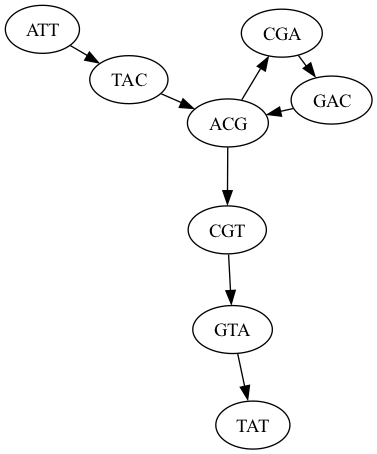
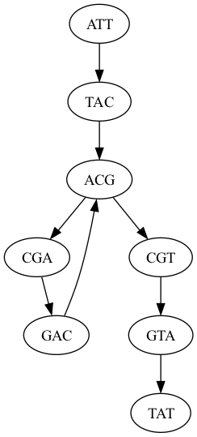

## Assignment 3: Mapping and WDLs
Assignment Date: Wednesday, September 20, 2023 <br>
Due Date: Wednesday, September 27, 2023 @ 11:59pm <br>

### Assignment Overview

In this assignment you will explore WDLs as a workflow language to orchestrate a variety of read mapping tasks. You can execute your WDLs using [miniwdl](https://github.com/chanzuckerberg/miniwdl) after running `pip install miniwdl`. You may also find [learn-wdl](https://github.com/openwdl/learn-wdl) to be very helpful.

If you are using a Mac, make sure to disable [gRPC FUSE for file sharing](https://github.com/chanzuckerberg/miniwdl/issues/145). There is a currently a very weird bug in Docker desktop 4.12.0 (docker engine 20.10.17) on Apple M1 where if you try to disable "Use gRPC FUSE for file sharing" via the GUI it will turn itself back on when you try to activate it. On M1 you will also need to set the DOCKER_HOST environment variable [Notes](https://github.com/chanzuckerberg/miniwdl/issues/652). Docker is aware of the problem and are working on a fix. In the meantime there is a workaround available: [https://github.com/docker/for-mac/issues/6467](https://github.com/docker/for-mac/issues/6467)

The bioinformatics tools you will need for the assignment (bowtie, samtools, etc) are bundled into a [Docker](https://www.docker.com) container so you wont need to install other software packages. This will get you ready to run your code in the cloud for future assignments. Instructions for running the container are available here: [https://github.com/mschatz/wga-essentials](https://github.com/mschatz/wga-essentials). This is known to work on new macs (M1) and older macs (intel chip). It should also run on Linux and Windows but let us know if you have any issues.

As a reminder, any questions about the assignment should be posted to [Piazza](https://piazza.com/jhu/fall2023/600449600649).

### Question 1. de Bruijn Graph construction [10 pts]
- Q1a. Draw (by hand or by code) the de Bruijn graph for the following reads using k=3 (assume all reads are from the forward strand, no sequencing errors, complete coverage of the genome). You may find [graphviz](https://graphviz.org/) to be helpful (install with `mamba install graphviz`).

```
ATTCA
ATTGA
CATTG
CTTAT
GATTG
TATTT
TCATT
TCTTA
TGATT
TTATT
TTCAT
TTCTT
TTGAT
```

- Q1b. Assume that the maximum number of occurrences of any 3-mer in the actual genome is 4 using the k-mers from Q1a. Write one possible genome sequence


- Q1c. What would it take to fully resolve the genome? [In a few sentences]


### Question 2. Hello World [5 pts]

- Using [miniwdl](https://github.com/chanzuckerberg/miniwdl), develop a Hello World workflow that takes in a user's name (`USER_NAME` in string format) and outputs a file saying `Hello, USER_NAME!`. Please submit your code as well as a screenshot of the window in which you run the code. **If you cannot successfully run miniwdl on your local computer, let us know as soon as possible so that we can provide an alternative.**


#### Question 3. Mapping Analysis [10 pts]

The goal of this question is to develop a WDL that will align pairs of read file (paired or matepairs) and computes alignment statistics. Download the reads and reference genome (same as assignment 2) from: [https://github.com/schatzlab/appliedgenomics2023/blob/main/assignments/assignment2/asm.tgz?raw=true](https://github.com/schatzlab/appliedgenomics2023/blob/main/assignments/assignment2/asm.tgz?raw=true)

- Question 3a. Write a WDL that indexes the reference genome provided (`ref.fa`): `bowtie2-build GENOME.fa GENOME`. Please submit your code as well as a screenshot of the window in which you run the code.

- Question 3b. Write a WDL that aligns pairs of read files, sorts the alignments, and computes coverage statistics. Specifically it should run these steps

 1. `bowtie2 -x GENOME -1 PREFIX.1.fq -2 PREFIX.2.fq -S PREFIX.sam`
 2. `samtools sort PREFIX.sam -o PREFIX.bam`
 3. `samtools stats PREFIX.bam > PREFIX.stats`

 Please submit the code for this but you do not need to include screenshots.
 
- Question 3c. Using the WDL from b, plot the insert size distribution (tag: IS) and the coverage distribution (tag: COV) for the paired end reads (frag180.X.fq). Please include the code for plotting (this part does not need to be in the WDL)

- Question 3d. Using the WDL from b, plot the insert size distribution (tag: IS) and the coverage distribution (tag: COV) for the paired end reads (jump2k.X.fq). Please include the code for plotting (this part does not need to be in the WDL)


### Question 4. Mappability Analysis [10 pts]

- 4a. Write a WDL to extract kmers of a specific length from a range of a given genome, and then align them back to a reference genome using bowtie2.  Please submit the code for this but you do not need to include screenshots.

- 4b. Using your WDL with k = 25, extract every k-mer from positions 20,000,000 to 25,000,000 on GRCh38 chromosome 22, and align them back to chromosome 22 (the entire chromosome) using bowtie2. How many 25-mers are mapped back to the correct position (the place they were extracted from) with mapq >= 20? How many are mapped with mapq >= 20, but to an incorrect position? You can download chr22 from assignment 1 here: [https://schatz-lab.org/appliedgenomics2023/assignments/assignment1/chr22.fa.gz](https://schatz-lab.org/appliedgenomics2023/assignments/assignment1/chr22.fa.gz

- 4c. We consider 25-mers that are mapped back to their correct position in the genome with mapq >= 20 to be uniquely mappable. For each position in 20,000,000-25,000,000 on chromosome 22, count how many uniquely mappable k-mers are mapped to it. Make a histogram of the number of positions in chromosome 22 with a given number of uniquely mappable k-mers overlapping them. Use k = 25, and the 25-mers you generated in part a. [Hint: How many 25-mers can uniquely map to any one base in chromosome 22?]

- 4d. Repeat the previous two questions for k = 50 and 100, and discuss (in a couple of sentences) the effect of k on how many k-mers are uniquely mappable and on how many uniquely mappable k-mers overlap each position in the genome.


### Packaging

The solutions to the above questions should be submitted as a single PDF document that includes your name, email address, and all relevant figures (as needed). If you use ChatGPT for any of the code, also record the prompts used. Submit your solutions by uploading the PDF to [GradeScope](https://www.gradescope.com/courses/587880), and remember to select where in your submission each question/subquestion is. The Entry Code is: JK5VB4. 

If you submit after this time, you will use your late days. Remember, you are only allowed 4 late days for the entire semester!


### Graphview Tips

It is very easy to render a graph using graphviz. For example, these commands will render [graph.dot](graph.dot) using `neato`:

```
$ cat graph.dot
digraph{
    ATT -> TAC
    TAC -> ACG
    ACG -> CGA
    CGA -> GAC
    GAC -> ACG
    ACG -> CGT
    CGT -> GTA
    GTA -> TAT
}
```

```$ neato -T png graph.dot -o neato.png```



Alternatively use `dot`

```$ dot -T png graph.dot -o dot.png```



